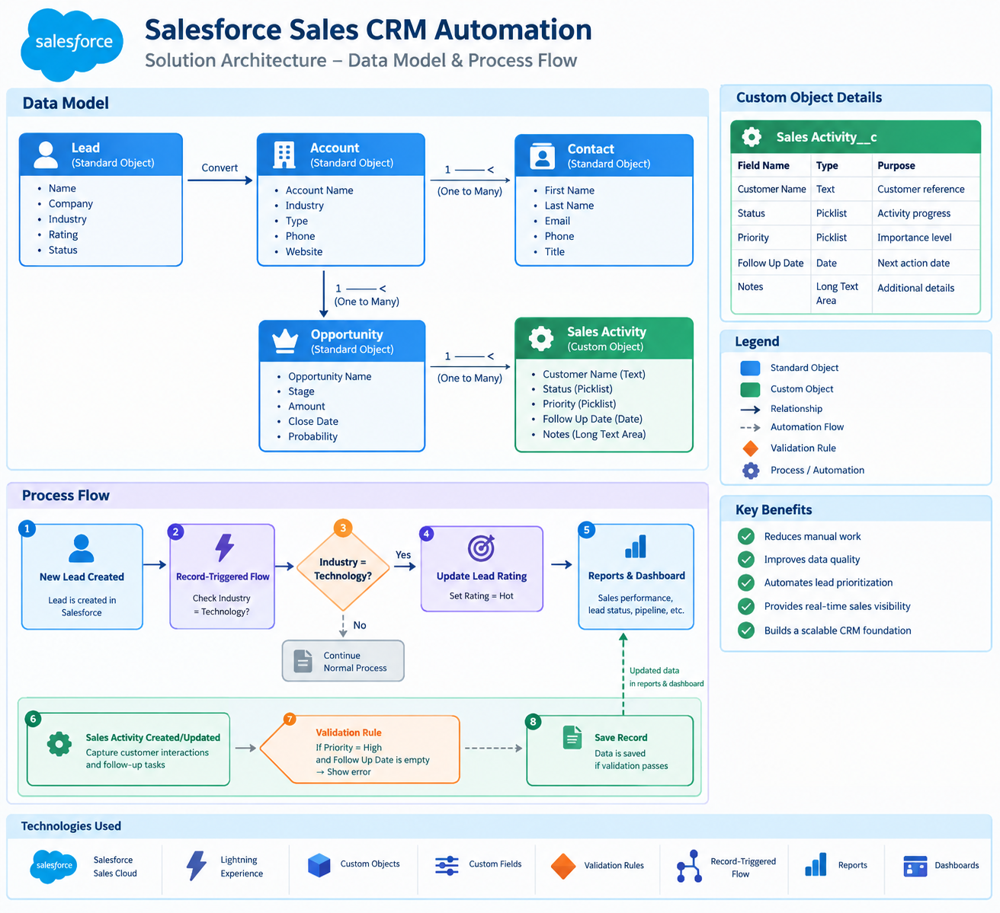

# Salesforce Sales CRM Automation

## Project Overview

A Salesforce CRM solution designed to improve sales data quality, automate business processes, and provide clear visibility into sales activity through reports and dashboards.

This project demonstrates how Salesforce configuration and automation can be combined to create a practical and maintainable CRM solution for a sales team.

---

## Business Problem

A sales team needs a structured way to manage CRM data while reducing manual work and improving data quality.

The solution addresses several common CRM challenges:

- Inconsistent or incomplete sales data
- Manual process execution
- Lack of validation for critical information
- Limited visibility into sales activity
- Difficulty monitoring records and sales priorities

---

## Solution

The Salesforce solution includes:

- Custom fields for business-specific information
- Validation rules to improve data quality
- Salesforce Flow for process automation
- Structured record management
- Sales reports for business analysis
- A dashboard providing a centralized view of sales activity

The automation reduces manual steps and helps users maintain more consistent CRM data.

---

## Salesforce Features Used

- Salesforce Sales Cloud
- Custom Objects / Fields
- Object Manager
- Validation Rules
- Salesforce Flow
- Reports
- Dashboards
- Record Management

---

## Custom Object: Sales Activity (Sales_Activity__c)

The Salesforce configuration includes sales activity information that supports the team's CRM workflow.

---

## Custom Fields

Custom fields were created to support the business requirements of the sales process.

- Customer Name
- Status
- Priority
- Follow Up Date
- Notes

---

## Automation

### Salesforce Flow

A record-triggered Flow runs when a new Lead is created. If the Lead's Industry is set to Technology, the Flow automatically updates the Lead Rating to Hot. This reduces manual work and ensures the process is applied consistently.

---

## Data Quality

### Validation Rule

A validation rule prevents a Sales Activity record from being saved when Priority is set to High without a Follow Up Date.

This helps maintain consistent and reliable CRM information.

---

## Records

The solution provides structured Salesforce records that can be managed through the CRM interface.

---

## Reports & Dashboard

Four reports were created to provide different views of the sales data:

1. **Leads by Status** – provides visibility into lead status distribution.
2. **Sales Pipeline** – provides visibility into the current sales pipeline.
3. **Sales Activities by Priority** – helps monitor sales activities based on priority.
4. **Open Opportunities by Owner** – provides visibility into open opportunities by owner.

A dashboard brings these reporting views together into a centralized business view.

---

## Business Value

The solution provides the following business benefits:

- Improved CRM data quality
- Reduced manual process steps
- More consistent business processes
- Better visibility into sales activity
- Easier monitoring of Leads and Opportunities
- Centralized reporting and dashboard visibility
- A scalable foundation for future Salesforce automation

---

## Technology Used

| Technology | Purpose |
|---|---|
| Salesforce Sales Cloud | CRM platform |
| Object Manager | Data and field configuration |
| Custom Fields | Business-specific data |
| Validation Rules | Data quality and validation |
| Salesforce Flow | Process automation |
| Reports | Sales data analysis |
| Dashboards | Visual business monitoring |

---

## Project Architecture

The solution architecture combines Salesforce data modeling, data validation, process automation, and reporting.

The architecture includes:

- Standard Salesforce objects: Lead, Account, Contact, and Opportunity
- Custom Sales Activity object (`Sales_Activity__c`)
- Validation rules for data quality
- Record-Triggered Flow for Lead automation
- Reports and Dashboard for sales visibility

### Solution Architecture

---

## Project Screenshots

All project screenshots are available in the [`screenshots`](screenshots/) folder.

---

## Skills Demonstrated

- Salesforce Administration
- Salesforce CRM Configuration
- Salesforce Flow
- Business Process Automation
- Data Validation
- Reports & Dashboards
- CRM Data Management
- Salesforce Solution Design

---

## Future Enhancements

Potential future improvements include:

- Apex-based automation for more complex business logic
- Lightning Web Components (LWC)
- Integration with external systems
- Automated notifications
- Advanced reporting
- Additional data quality controls
- API-based integrations

---

## Author

**Nazik Gurbanova | Salesforce Developer**

**Certifications:**
- Salesforce Certified Administrator
- Salesforce Platform Developer I
