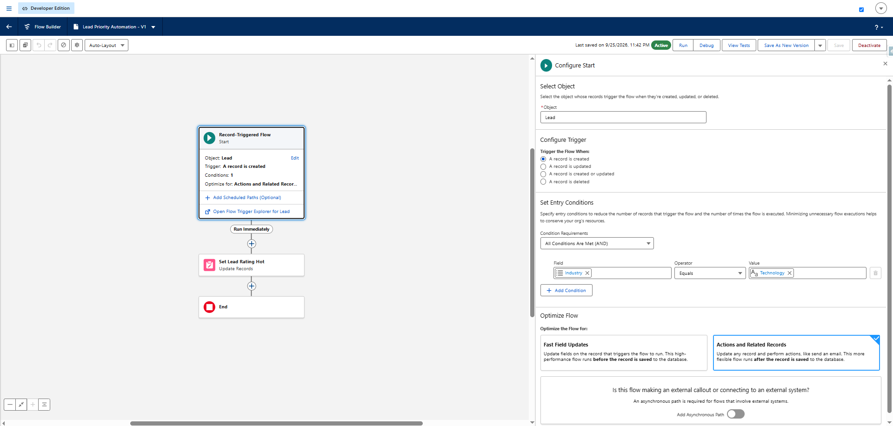
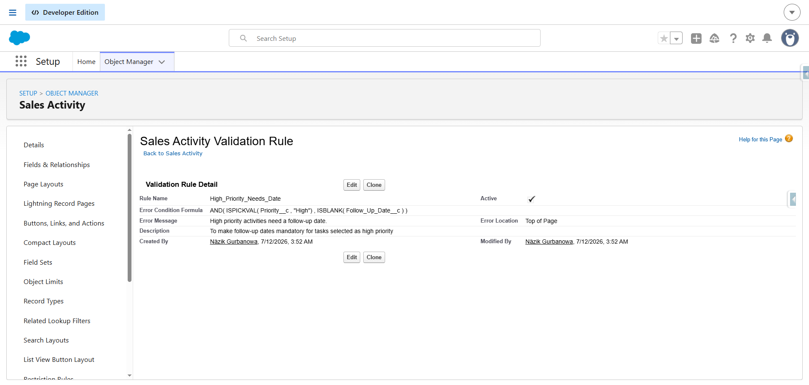
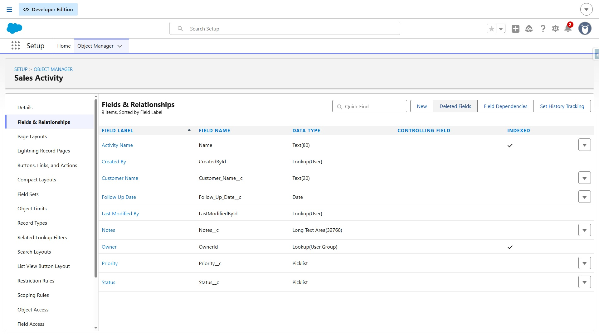
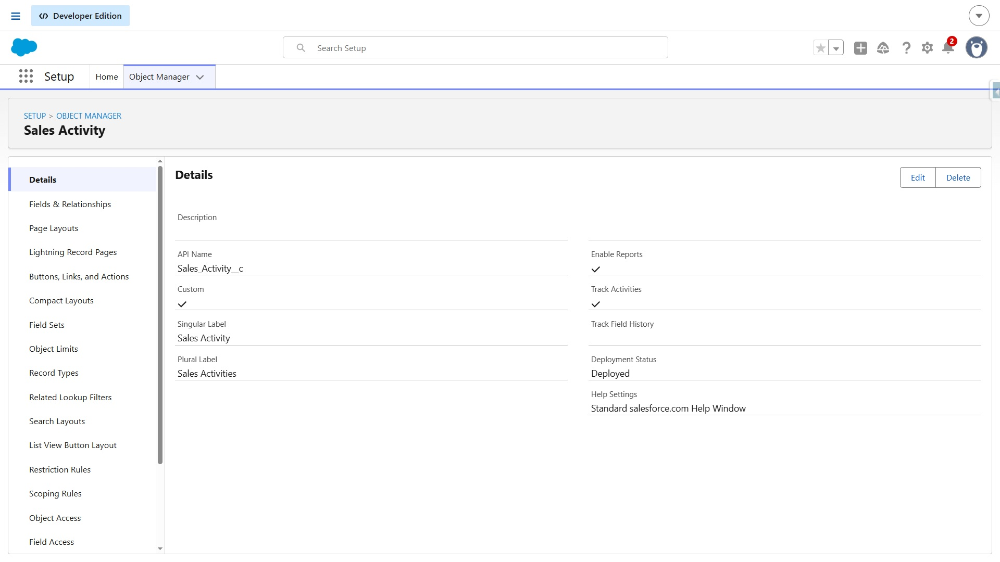
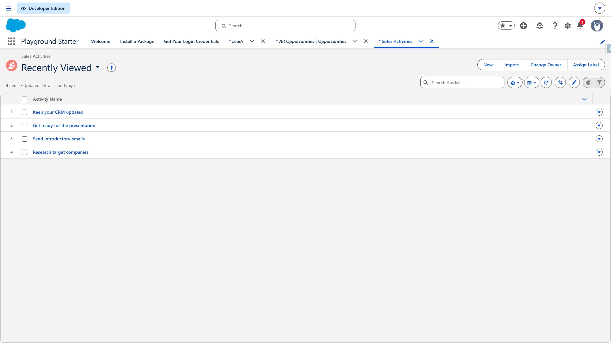
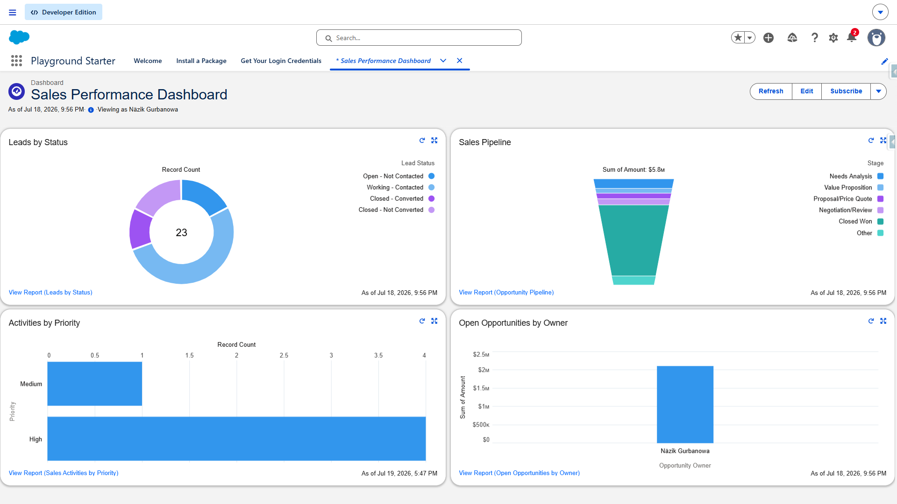

# Salesforce Sales CRM Automation

## Project Overview

A Salesforce CRM solution designed to improve sales data quality, automate business processes, and provide clear visibility into sales activity through reports and dashboards.

This project demonstrates how Salesforce configuration and automation can be combined to create a practical and maintainable CRM solution for a sales team.

---

## Business Problem

A sales team needs a structured way to manage CRM data while reducing manual work and improving data quality.

The solution addresses several common CRM challenges:

- Inconsistent or incomplete sales data
- Manual process execution
- Lack of validation for critical information
- Limited visibility into sales activity
- Difficulty monitoring records and sales priorities

---

## Solution

The Salesforce solution includes:

- Custom fields for business-specific information
- Validation rules to improve data quality
- Salesforce Flow for process automation
- Structured record management
- Sales reports for business analysis
- A dashboard providing a centralized view of sales activity

The automation reduces manual steps and helps users maintain more consistent CRM data.

---

## Salesforce Features Used

- Salesforce Sales Cloud
- Custom Objects / Fields
- Object Manager
- Validation Rules
- Salesforce Flow
- Reports
- Dashboards
- Record Management

---

## Automation

### Salesforce Flow

A Salesforce Flow was created to automate the defined business process.

The Flow helps reduce manual actions and ensures that the required process is executed consistently when the relevant record conditions are met.

---

## Data Quality

### Validation Rule

A validation rule was implemented to prevent invalid or incomplete data from being saved.

This helps maintain consistent and reliable CRM information.

---

## Custom Fields

Custom fields were created to support the business requirements of the sales process.

---

## Sales Activity

The Salesforce configuration includes sales activity information that supports the team's CRM workflow.

---

## Records

The solution provides structured Salesforce records that can be managed through the CRM interface.

---

## Reports & Dashboard

Four reports were created to provide different views of the sales data.

The reports support analysis of:

- Leads
- Opportunities
- Priority
- Record ownership

A dashboard brings the reporting information together into a centralized business view.

---

## Business Value

The solution provides the following business benefits:

- Improved CRM data quality
- Reduced manual process steps
- More consistent business processes
- Better visibility into sales activity
- Easier monitoring of Leads and Opportunities
- Centralized reporting and dashboard visibility
- A scalable foundation for future Salesforce automation

---

## Technology Used

| Technology | Purpose |
|---|---|
| Salesforce Sales Cloud | CRM platform |
| Object Manager | Data and field configuration |
| Custom Fields | Business-specific data |
| Validation Rules | Data quality and validation |
| Salesforce Flow | Process automation |
| Reports | Sales data analysis |
| Dashboards | Visual business monitoring |

---

## Project Architecture

The project follows a simple CRM automation architecture:

**Salesforce Records → Validation → Automation → Reports → Dashboard**

The solution is designed to keep data quality, automation, and reporting connected within the Salesforce platform.

---

## Project Screenshots

All project screenshots are available in the [`screenshots`](screenshots/) folder.

---

## Skills Demonstrated

- Salesforce Administration
- Salesforce CRM Configuration
- Salesforce Flow
- Business Process Automation
- Data Validation
- Reports & Dashboards
- CRM Data Management
- Salesforce Solution Design

---

## Future Enhancements

Potential future improvements include:

- Apex-based automation for more complex business logic
- Lightning Web Components (LWC)
- Integration with external systems
- Automated notifications
- Advanced reporting
- Additional data quality controls
- API-based integrations

---

## Author

**Nazik Gurbanova**
Salesforce Developer

**Certifications:**
- Salesforce Certified Administrator
- Salesforce Platform Developer I
